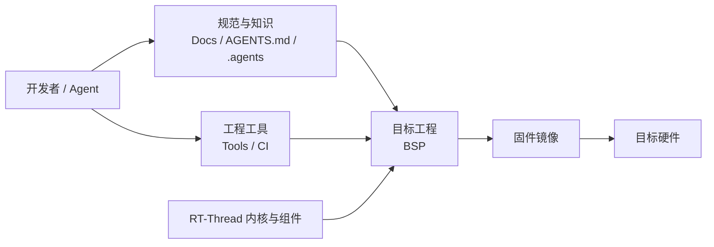
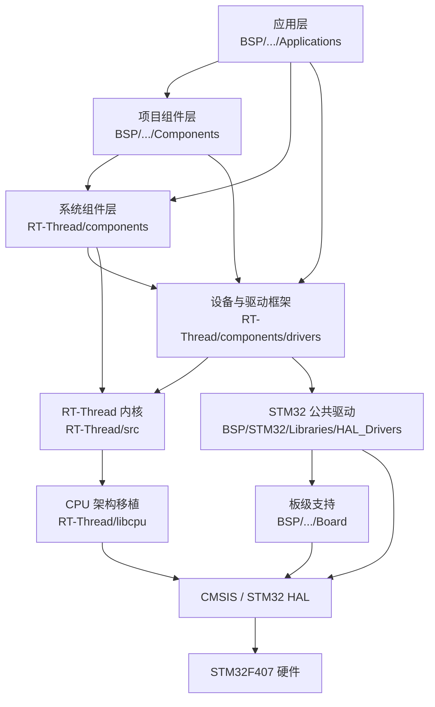
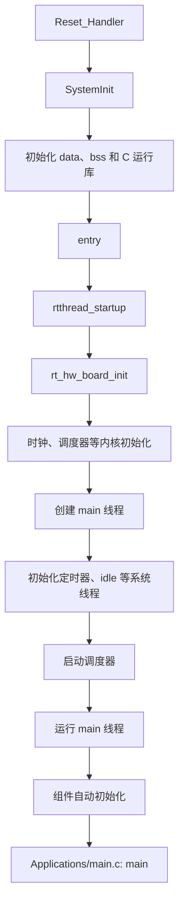
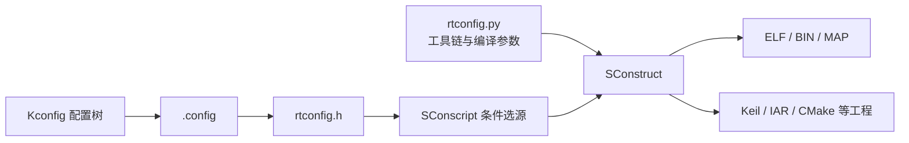

# 工程架构总览

## 1. 文档目的

本文描述 Agent+ 嵌入式智能开发平台的整体架构、各层职责、依赖方向和主要扩展点，帮助开发者在修改工程前判断代码应放置的位置。

本文关注工程级架构，不展开内核算法、设备模型细节和单个 BSP 的外设配置。

STM32F407 是当前仓库的基准验证平台，文中的运行时示例以该 BSP 为主。

## 2. 工程定位

本工程基于 RT-Thread 进行二次组织和扩展，目标是提供一个可复用的嵌入式开发基础平台，而不是承载某个具体产品的全部业务代码。

工程同时包含两类内容：

- **目标系统内容**：应用、板级适配、驱动、RT-Thread 内核及组件，最终参与固件构建。
- **工程支撑内容**：构建工具、文档、Agent 规则和 CI 配置，只服务于开发过程，不进入目标固件。

## 3. 顶层目录职责

| 目录 | 职责 | 是否进入固件 | 维护边界 |
| --- | --- | --- | --- |
| `BSP/` | 保存芯片家族公共支持和具体板级工程 | 是 | 项目开发的主要工作区 |
| `RT-Thread/` | 保存 RT-Thread 内核、CPU 移植、组件、头文件和测试代码 | 是 | 尽量保持上游兼容，如非必要不修改 |
| `Tools/` | 保存 SCons 构建框架、配置工具、工程生成器和 CI 辅助脚本 | 否 | 面向所有 BSP 复用 |
| `Docs/` | 保存环境、协作规范和架构说明 | 否 | 与工程结构和流程同步维护 |
| `.agents/`、`AGENTS.md` | 保存 Agent 操作规则、知识和技能入口 | 否 | 约束自动化操作 |
| `.github/` | 保存持续集成和仓库自动化配置 | 否 | 验证工程质量和协作流程 |

## 4. 目标固件分层

目标固件采用自上而下的分层结构。上层通过稳定接口使用下层能力，下层不反向依赖具体业务。

### 4.1 应用层

`BSP/<芯片家族>/<目标>/Applications/` 保存具体目标的应用入口和业务功能。

当前 STM32F407 BSP 的 `Applications/main.c` 提供用户态 `main()`。应用目录的根级 C 文件由 `Applications/SConscript` 收集；规模较大的功能应放入独立子目录，并由该子目录自己的 `SConscript` 和 `Kconfig` 管理源码与配置。

### 4.2 项目组件层

`BSP/<芯片家族>/<目标>/Components/` 保存只服务于当前目标、但具有独立职责和复用价值的组件。它适合承载协议适配、设备服务或领域功能，不适合放置通用 RT-Thread 修改。

项目组件必须显式加入 `Components/SConscript`，并通过 `Components/Kconfig` 暴露配置项，避免无边界的递归源码扫描。

### 4.3 RT-Thread 系统组件层

`RT-Thread/components/` 提供设备框架、文件系统、网络、libc、FinSH、软件包基础设施等通用能力。各组件通过自己的 `Kconfig` 和 `SConscript` 声明配置及构建条件。

该层面向多个芯片和 BSP，共性能力应优先通过扩展接口接入；若必须修改，应评估与 RT-Thread 上游同步的成本。

### 4.4 内核与 CPU 移植层

- `RT-Thread/src/`：线程、调度、时钟、IPC、内存、对象管理和自动初始化等内核机制。
- `RT-Thread/include/`：内核及公共接口头文件。
- `RT-Thread/libcpu/`：中断、上下文切换和 CPU 架构相关实现。

STM32F407 的 `rtconfig.py` 指定 `ARCH='arm'`、`CPU='cortex-m4'`，构建系统据此选择 `RT-Thread/libcpu/arm/` 下相应移植代码。

### 4.5 芯片家族公共驱动层

`BSP/STM32/Libraries/` 保存 STM32 家族共享的 Kconfig 和 HAL 驱动适配。`HAL_Drivers/` 将 STM32 HAL 外设能力接入 RT-Thread 的设备模型，供多个 STM32 BSP 复用。

这一层不得依赖某个具体产品的应用逻辑。只有可被同一芯片家族多个目标复用的实现才应放在这里。

### 4.6 板级支持层

`BSP/STM32/STM32F407/Board/` 保存启动文件、链接脚本、时钟配置、CMSIS、STM32 HAL 和板级驱动配置。

板级目录负责回答“这块硬件如何启动和访问”，不负责实现产品业务。具体文件边界参见 `BSP/STM32/STM32F407/Board/README.md`。

## 5. 关键依赖规则

为避免 BSP、通用组件和业务代码相互缠绕，新增代码应遵循以下依赖方向：

1. 应用可以依赖项目组件、RT-Thread 组件和公开设备接口。
2. 项目组件可以依赖 RT-Thread 公共接口，但不得依赖某个应用功能。
3. STM32 公共驱动可以依赖 RT-Thread 设备框架和 STM32 HAL，但不得依赖具体 BSP 的应用代码。
4. 板级代码只处理启动、时钟、内存、中断、引脚和外设实例等硬件差异。
5. `RT-Thread/` 保持上游边界，项目差异优先在 BSP 或扩展组件中实现。
6. `Tools/`、`Docs/`、Agent 配置和 CI 配置不得成为目标源码的运行时依赖。

当一个功能无法明确归层时，可按其复用范围判断：

| 复用范围 | 推荐位置 |
| --- | --- |
| 仅当前应用使用 | `BSP/.../Applications/<Feature>/` |
| 当前 BSP 的多个应用功能使用 | `BSP/.../Components/<Component>/` |
| STM32 多个 BSP 共用 | `BSP/STM32/Libraries/` |
| 与芯片无关且多个架构共用 | 优先独立组件；确需进入系统层时放入 `RT-Thread/components/` |
| CPU 上下文或架构强相关 | `RT-Thread/libcpu/<arch>/` |

## 6. 启动与运行时概览

以 STM32F407 的 GCC 构建为例，系统从芯片启动文件进入 RT-Thread，再创建主线程执行应用：

当前 BSP 的 Kconfig 默认选择 `RT_USING_COMPONENTS_INIT` 和 `RT_USING_USER_MAIN`。组件根据初始化级别进入链接注册表，并在主线程调用应用 `main()` 前完成相应初始化。

不同工具链的 C 运行库入口实现不同，但都会汇入 `rtthread_startup()`；具体启动文件由 `Board/SConscript` 按当前工具链选择。

## 7. 配置与构建控制面

工程采用 Kconfig 选择功能，采用 SCons 解析模块描述并执行构建：

- Kconfig 决定启用哪些内核能力、组件和外设。
- `rtconfig.h` 将配置转化为 C 预处理宏，是构建时的功能选择输入。
- 各级 `SConscript` 根据配置宏选择源码、头文件路径、宏和链接参数。
- `rtconfig.py` 定义架构、工具链、编译参数、链接脚本和输出目录。
- BSP 根目录的 `SConstruct` 组装 BSP、RT-Thread 和公共 STM32 驱动。

完整流程和常用命令参见 [构建与配置架构](08-Build-and-Configuration.md)。

## 8. 基准平台

当前仓库以 `BSP/STM32/STM32F407/` 作为测试与验证基准，其主要架构属性如下：

| 属性 | 当前值 |
| --- | --- |
| SoC | STM32F407ZG |
| CPU 架构 | ARM Cortex-M4 |
| 默认工具链 | GNU Arm Embedded Toolchain |
| 可选工具链 | GCC、Arm Compiler 5、Arm Compiler 6、IAR |
| 默认构建系统 | SCons |
| 工程生成能力 | Keil、IAR、CMake 等 |
| SCons 输出目录 | `BSP/STM32/STM32F407/Build/scons/` |

基准 BSP 的配置不代表所有未来目标必须采用相同芯片、工具链或外设组合。新增 BSP 应保持相同的职责分层和构建接口。

## 9. 主要扩展场景

### 9.1 新增应用功能

在目标 BSP 的 `Applications/` 下创建独立功能目录，通过局部 `SConscript` 管理源码，通过 `Kconfig` 声明可配置项。应用应优先调用 RT-Thread 设备接口，而不是直接操作 HAL。

### 9.2 新增目标专用组件

在目标 BSP 的 `Components/` 下创建组件，并分别接入顶层 `Components/SConscript` 与 `Components/Kconfig`。组件公开接口应与内部实现分离。

### 9.3 新增或启用外设

先确认 `BSP/STM32/Libraries/HAL_Drivers/` 是否已有对应 RT-Thread 驱动，再在板级 Kconfig、驱动配置和必要的 MSP/中断代码中完成硬件实例适配，避免重复实现设备框架。

### 9.4 新增 BSP

新增 BSP 至少需要提供 Kconfig 根、`SConstruct`、BSP 根 `SConscript`、`rtconfig.py`、应用目录、板级目录以及对应启动文件和链接脚本。可以复用芯片家族公共驱动，但不得让现有 BSP 反向依赖新 BSP。

## 10. 关键源码入口

| 关注点 | 入口文件 |
| --- | --- |
| 工程说明 | `README.md` |
| BSP 配置根 | `BSP/STM32/STM32F407/Kconfig` |
| BSP 构建入口 | `BSP/STM32/STM32F407/SConstruct` |
| BSP 模块聚合 | `BSP/STM32/STM32F407/SConscript` |
| 工具链和链接参数 | `BSP/STM32/STM32F407/rtconfig.py` |
| 应用入口 | `BSP/STM32/STM32F407/Applications/main.c` |
| 板级适配说明 | `BSP/STM32/STM32F407/Board/README.md` |
| RT-Thread 配置根 | `RT-Thread/Kconfig` |
| RT-Thread 启动与自动初始化 | `RT-Thread/src/components.c` |
| 通用构建框架 | `Tools/building.py` |

## 11. 架构维护原则

发生以下变化时，应同步更新本文：

- 顶层目录职责或依赖方向改变；
- 新增芯片家族、基准 BSP 或主要运行时层；
- RT-Thread 源码同步策略改变；
- 配置系统或主构建系统改变；
- 应用、项目组件和公共驱动的边界调整。

若实现与本文不一致，应先判断是实现偏离既定架构，还是架构本身已经演进。前者应修正实现，后者应同时更新文档并记录原因。
