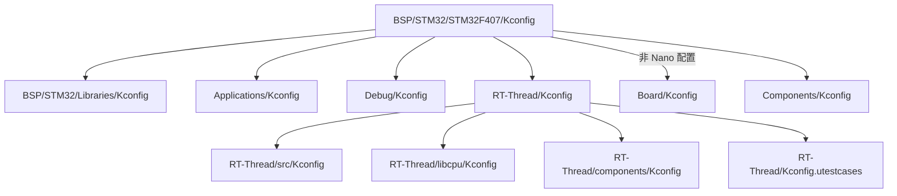
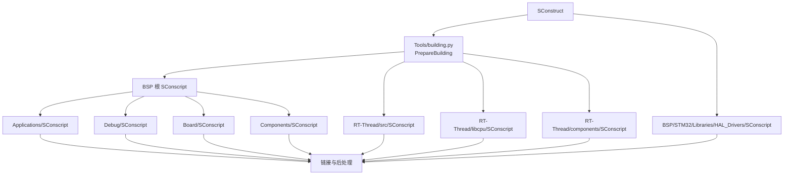

# 构建与配置架构

## 1. 文档目的

本文描述工程从功能配置到固件产出的完整链路，说明 Kconfig、`rtconfig.h`、SCons、工具链配置和工程生成器之间的职责。

当前仓库以 `BSP/STM32/STM32F407/` 作为基准目标。其他 BSP 应复用相同的总体机制，但可以拥有独立的 Kconfig、工具链参数、链接脚本和输出目录。

## 2. 构建系统定位

SCons 是当前工程的主构建入口和源码集合的权威描述。Keil、IAR、CMake 等工程由 SCons 的模块信息生成，是同一构建模型的其他表现形式。


维护源码集合、宏、包含路径或链接依赖时，应先修改相应 `SConscript`，再重新生成其他工程。不要只在 IDE 中手工增删文件，否则 IDE 与 SCons 的构建内容会产生漂移。

## 3. 使用前提

开发环境、Python 虚拟环境、SCons 和 GNU Arm 工具链的安装步骤参见 [Windows 开发环境搭建](../Environment/Windows开发环境搭建.md)。

所有配置和构建命令均应在目标 BSP 根目录执行：

```bash
cd BSP/STM32/STM32F407
```

BSP 根目录同时包含 `Kconfig`、`SConstruct`、`SConscript`、`rtconfig.h` 和 `rtconfig.py`。从仓库根目录直接执行 SCons 不会得到该 BSP 的构建上下文。

## 4. 配置体系

### 4.1 Kconfig 配置树

STM32F407 的 `Kconfig` 是配置入口，其包含关系如下：



根配置固定选择 `SOC_STM32F407ZG`，并由该符号选择 `SOC_SERIES_STM32F4`、`RT_USING_COMPONENTS_INIT` 和 `RT_USING_USER_MAIN`。其余功能通过各层 Kconfig 按职责声明。

新增配置项时，应放在拥有该功能实现的模块中：

| 配置对象 | 推荐位置 |
| --- | --- |
| 应用功能 | `Applications/<Feature>/Kconfig`，由 `Applications/Kconfig` 聚合 |
| 调试功能 | `Debug/<Feature>/Kconfig`，由 `Debug/Kconfig` 聚合 |
| 当前 BSP 专用组件 | `Components/<Component>/Kconfig`，由 `Components/Kconfig` 聚合 |
| 板载外设和实例 | `Board/Kconfig` |
| STM32 家族公共驱动 | `BSP/STM32/Libraries/` 下对应 Kconfig |
| RT-Thread 通用能力 | `RT-Thread/` 下所属模块的 Kconfig |

### 4.2 配置文件职责

| 文件 | 职责 | 版本管理策略 |
| --- | --- | --- |
| `Kconfig` 及子级 Kconfig | 声明配置项、默认值、依赖和选择关系 | 应提交 |
| `.config` | 记录当前 BSP 的功能选择，是可审查、可复现的配置基线 | 当前 BSP 已跟踪 |
| `.config.old` | 配置工具保存的上一次状态 | 当前 BSP 已忽略 |
| `rtconfig.h` | 由 `.config` 生成，将生效配置暴露为 C 预处理宏，也是 SCons 条件选源的输入 | 当前 BSP 已跟踪 |
| `rtconfig.py` | 定义架构、工具链、编译参数、链接脚本和产物路径 | 应提交 |

新检出工作区直接使用版本库中的 `.config`。Kconfig 定义发生变化、解决配置合并冲突或需要非交互式整理时，先执行：

```bash
scons --defconfig
```

该命令会根据当前 Kconfig 整理 `.config` 并重新生成 `rtconfig.h`。配置界面保存后也会更新这两个文件。提交配置变更时，应同时检查并提交 `.config`、`rtconfig.h` 以及相关 Kconfig 源文件，不应提交 `.config.old`。

`scons --genconfig` 仅用于 `.config` 丢失时从 `rtconfig.h` 恢复配置，常规工作流不需要执行。

### 4.3 常用配置命令

```bash
# .config 丢失时，从当前 rtconfig.h 恢复
scons --genconfig

# 打开终端配置界面
scons --menuconfig

# 打开 Python 图形配置界面
scons --pyconfig

# 根据当前 Kconfig 和 .config 进行非交互式整理，并生成 rtconfig.h
scons --defconfig

# 从指定配置文件生成 rtconfig.h
scons --useconfig=<配置文件路径>
```

`--menuconfig` 和 `--pyconfig` 都由 `Tools/env_utility.py` 驱动。配置工具的工作目录必须是 BSP 根目录，否则无法找到正确的 `Kconfig` 和输出文件。

## 5. 工具链配置

### 5.1 架构和工具链选择

STM32F407 的 `rtconfig.py` 固定目标架构为 ARM Cortex-M4，默认工具链为 GCC：

```text
ARCH       = arm
CPU        = cortex-m4
CROSS_TOOL = gcc
```

环境变量 `RTT_CC` 可以覆盖工具链选择，当前 BSP 支持以下值：

| `RTT_CC` | `PLATFORM` | 主要工具 |
| --- | --- | --- |
| `gcc` | `gcc` | `arm-none-eabi-gcc` |
| `keil` | `armcc` | Arm Compiler 5 |
| `armclang` | `armclang` | Arm Compiler 6 |
| `iar` | `iccarm` | IAR C/C++ Compiler |

`rtconfig.py` 根据最终平台选择对应启动文件、链接脚本、目标扩展名、编译参数和固件转换命令。

### 5.2 编译器路径优先级

工具链可执行目录可以来自以下位置：

1. 环境变量 `RTT_EXEC_PATH`；
2. `Config/toolchain_config.local.py` 中的 `TOOLCHAIN_PATHS`；
3. 当前终端的 `PATH` 或构建工具的自动探测结果。

推荐复制平台示例文件创建本机配置：

```powershell
Copy-Item Config/toolchain_config.windows.example.py Config/toolchain_config.local.py
```

`Config/toolchain_config.local.py` 已被 Git 忽略，适合保存本机绝对路径。不要把个人安装路径写入受版本管理的 `rtconfig.py` 或示例文件。

### 5.3 其他环境覆盖项

| 变量 | 用途 | 默认行为 |
| --- | --- | --- |
| `RTT_ROOT` | 指定 RT-Thread 源码根目录 | 使用仓库内 `RT-Thread/` |
| `RTT_CC` | 选择工具链类型 | 使用 `gcc` |
| `RTT_EXEC_PATH` | 指定编译器可执行目录 | 使用本机配置或自动探测 |

常规开发应使用仓库内默认路径。只有验证外部 RT-Thread 源码或临时工具链时才建议覆盖这些变量，并在问题记录中注明实际取值。

### 5.4 启动文件与链接脚本命名

各 BSP 应将启动文件放在 `Board/Startup/<工具链>/Startup.s`，将链接脚本放在
`Board/LinkerScripts/<工具链>/`，并统一采用 `LinkerScripts` 作为文件基名。
扩展名由工具链决定：GCC 使用 `.ld`，Keil/ArmClang 使用 `.sct`，IAR 使用
`.icf`。同一工具链存在多个内存布局时，在基名后增加布局后缀，例如
`LinkerScripts_SRAM.icf`。

这一命名约定使 BSP 模板的目录结构和构建接入点保持稳定；芯片型号、容量和
内存区域等差异应体现在文件内容中，而不依赖文件名前缀表达。

## 6. SCons 构建链路

### 6.1 BSP 构建入口

`BSP/STM32/STM32F407/SConstruct` 完成以下工作：

1. 计算 BSP、工程、`Tools/`、`RT-Thread/` 和 STM32 公共库的绝对路径。
2. 检查 `Tools/building.py`、内核、CPU 移植、系统组件和 HAL 驱动构建脚本是否存在。
3. 根据 `rtconfig.py` 创建编译环境并配置工具链路径。
4. 将中间文件和 SCons 数据库放入 `Build/scons/`。
5. 调用 `PrepareBuilding()` 加载 BSP、RT-Thread 内核、CPU 移植和系统组件。
6. 额外加载 `BSP/STM32/Libraries/HAL_Drivers/SConscript`。
7. 使用当前链接脚本生成最终目标，并执行 BIN 转换和 size 输出。

### 6.2 源码聚合



各 `SConscript` 使用 `DefineGroup()` 声明源码组、依赖条件、包含路径、宏和局部编译参数。`Tools/building.py` 解析 `rtconfig.h` 后，只装配满足配置条件的源码组。

构建采用独立的 `variant_dir`，因此目标文件位于 `Build/scons/`，不会散落到源码目录中。

### 6.3 常用构建命令

```bash
# 默认 GCC 构建
scons -j8

# 构建并生成 compile_commands.json
scons --cdb -j8

# 将全部编译警告提升为错误
scons --strict -j8

# 显示完整编译命令
scons --verbose -j8

# 清理 SCons 构建产物
scons -c
```

并行度 `-j8` 只是示例，应根据主机 CPU 和内存调整。CI 或发布构建应记录实际命令、工具链版本和配置版本。

## 7. 构建产物

SCons 直接构建统一输出到：

```text
BSP/STM32/STM32F407/Build/scons/
```

默认 GCC 构建的主要产物如下：

| 产物 | 用途 |
| --- | --- |
| `rt-thread.elf` | 带符号的可执行文件，用于调试和下载 |
| `rtthread.bin` | 裸二进制固件镜像 |
| `rt-thread.map` | 链接映射、符号和内存占用分析 |
| `compile_commands.json` | 编辑器、clangd 和静态分析工具使用；通过 `--cdb` 生成 |
| `.sconsign.dblite` | SCons 增量构建数据库 |

Arm Compiler 5/6 的主目标扩展名为 `.axf`，IAR 的主目标扩展名为 `.out`；BIN 和 MAP 的职责保持一致。

`Build/`、IDE 输出目录、固件和本机配置均由 BSP 的 `.gitignore` 排除。它们是可再生结果，不应作为源码提交。

## 8. 工程文件生成

SCons 可以根据已解析的源码组生成其他构建前端或 IDE 工程：

```bash
# Keil MDK 5
scons --target=mdk5

# Keil MDK 6
scons --target=mdk6

# IAR EWARM
scons --target=iar

# CMake
scons --target=cmake
```

生成操作不会替代 Kconfig 和 `SConscript`。配置或源码清单变化后，应重新生成工程。项目模板文件是受版本管理的输入，生成后的 `MDK*-ARM/`、`EWARM/`、CMake 构建目录等属于本地产物。

## 9. 修改不同内容时的构建接入点

| 修改类型 | 配置入口 | 构建入口 | 最低验证建议 |
| --- | --- | --- | --- |
| 应用根级 C 文件 | 通常无需新增配置 | `Applications/SConscript` 自动收集 | SCons 增量构建 |
| 独立应用功能 | `Applications/Kconfig` 或子级 Kconfig | 功能目录的 `SConscript` | 关闭和开启配置各构建一次 |
| BSP 专用组件 | `Components/Kconfig` | `Components/SConscript` 显式注册 | 检查依赖关闭时不参与构建 |
| 板载外设 | `Board/Kconfig` | `Board/Drivers/SConscript` 及公共 HAL 驱动脚本 | 干净构建并检查 MAP |
| RT-Thread 通用组件 | 所属组件 Kconfig | 所属组件 `SConscript` | 至少用基准 BSP 验证 |
| 工具链或链接参数 | 通常无 Kconfig | `rtconfig.py`、链接脚本 | 对受影响工具链执行干净构建 |
| 源码组或生成器逻辑 | 无 | `SConstruct`、`SConscript`、`Tools/` | SCons 构建并重新生成相关工程 |

## 10. 推荐工作流

### 10.1 修改功能配置

1. 在 BSP 根目录执行 `scons --defconfig`，按当前 Kconfig 整理已跟踪的 `.config` 并同步 `rtconfig.h`。
2. 执行 `scons --menuconfig` 或 `scons --pyconfig` 修改配置。
3. 检查 `.config` 和 `rtconfig.h` 的差异，确认只有预期配置发生变化。
4. 执行 `scons -c` 后再执行 `scons --cdb -j8`。
5. 检查 ELF、BIN、MAP 和 `compile_commands.json` 是否生成。

### 10.2 修改源码或构建脚本

1. 确认源码放置层级和对应 `SConscript`。
2. 若功能可裁剪，同时补充 Kconfig 依赖。
3. 执行 `scons --strict -j8` 验证默认配置。
4. 对条件编译功能验证“启用”和“禁用”两种配置。
5. 若维护 IDE 或 CMake 工程，重新运行相应 `--target` 生成命令。

## 11. 常见问题定位

### 11.1 找不到构建依赖

`SConstruct` 启动时会检查 `Tools/building.py`、RT-Thread 各级 `SConscript` 和 STM32 HAL 驱动脚本。出现 `Missing build dependency` 时，优先检查仓库目录是否完整，以及 `RTT_ROOT` 是否错误覆盖。

### 11.2 找不到编译器

依次检查：

1. `RTT_CC` 是否选择了正确工具链；
2. `RTT_EXEC_PATH` 是否指向可执行文件所在目录；
3. `Config/toolchain_config.local.py` 是否存在且键名正确；
4. 当前工具链命令能否在终端直接运行。

### 11.3 配置修改未生效

检查 `.config` 与 `rtconfig.h` 是否同步，并确认源码所在 `SConscript` 使用了正确的配置依赖。构建系统根据 `rtconfig.h` 选择源码；若手工修改了 `.config`，应执行 `scons --defconfig` 重新生成头文件。

### 11.4 SCons 与 IDE 构建内容不同

以 Kconfig 和 `SConscript` 为准，删除或重新生成本地 IDE 工程。不要通过 IDE 的工程树长期维护源码清单。

### 11.5 修改后仍使用旧目标文件

先执行 `scons -c`，再进行完整构建。若问题只出现在生成工程中，应同时清理该工程自己的输出目录并重新生成工程文件。

## 12. 构建变更检查表

- [ ] 命令从目标 BSP 根目录执行。
- [ ] `.config`、`rtconfig.h` 和 Kconfig 定义一致。
- [ ] 配置变更同时包含 `.config` 和 `rtconfig.h`，且未包含 `.config.old`。
- [ ] 新源码由职责正确的 `SConscript` 管理。
- [ ] 条件源码具有明确的 Kconfig 依赖。
- [ ] 本机绝对路径只写入已忽略的本机配置。
- [ ] 默认工具链完成一次干净构建。
- [ ] 受影响的可选工具链或生成工程已重新验证。
- [ ] ELF、BIN、MAP 和编译数据库位于约定目录。
- [ ] 未提交 `Build/`、IDE 输出、本机路径或其他可再生产物。

## 13. 相关文件

| 内容 | 文件 |
| --- | --- |
| 工程总体分层 | `Docs/Architecture/01-System-Overview.md` |
| Windows 环境搭建 | `Docs/Environment/Windows开发环境搭建.md` |
| BSP 构建入口 | `BSP/STM32/STM32F407/SConstruct` |
| BSP 源码聚合 | `BSP/STM32/STM32F407/SConscript` |
| BSP 配置入口 | `BSP/STM32/STM32F407/Kconfig` |
| 工具链参数 | `BSP/STM32/STM32F407/rtconfig.py` |
| 本机工具路径说明 | `BSP/STM32/STM32F407/Config/README.md` |
| 通用构建逻辑 | `Tools/building.py` |
| SCons 命令选项 | `Tools/options.py` |
| 配置转换逻辑 | `Tools/env_utility.py` |
